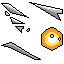

# Object texture file

This is the texture/graphics format used by objects.

It contains graphics for all body parts / limbs in the same file, and objects use `TexQuad` [frames](object.md) to locate pos/size of each limb:


> Graphics data for the `ELEMENTAL` object. (For reference, `ELEMENTAL` [object data](object.md) is in [file ID](../fs.md) 25257, and its graphics data is in file ID 7303).

## File format

The file itself starts with its own color palette table, and is followed by its dimensions and graphics data:

```
u8 color_count;
u16 colors[color_count];
u8 width;
u8 height;
u8 char_data[width * height / 2];
```

## Color and pixel formats

Colors are `XBGR1555` format: 5-bits per color, where the final bit is ignored (see below how alpha is dealt with).

The implicit format for graphic character data is 4BPP, hence each char data `u8` contains information for two pixels (low 4-bits for the first pixel, high 4-bits for the next one). Each of these 4-bit values is just a color index (index in the preceding color table).

The first color is considered transparent by the game: although the first color table entry usually has a purple color (full red+blue color, `#FF00FF` if it were converted to RGB). In other words, if the 4-bit char data value is `0` for a given pixel, then that pixel is seen as transparent in-game.

> Note: this is something frequently seen as well in other DS games
